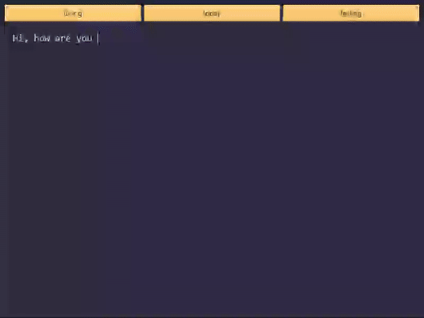

# Text Autocomplete Tool

This is a text autocomplete tool that uses Markov chains to predict and suggest words as you type. It provides a user-friendly graphical interface for text input and autocompletion.



## How It Works

The tool uses Markov chains to predict the next word based on the previous words. It analyzes a dataset of text to build a probabilistic model of word sequences. As you type, it uses this model to suggest likely word completions.

## Features

- Real-time word prediction and autocompletion
- Graphical user interface for easy interaction
- Utilizes Markov chains for intelligent text prediction
- Supports multiple orders of Markov chains for improved accuracy

## Libraries Used

- [PyQt6](https://pypi.org/project/PyQt6/) : For creating the graphical user interface
- [nltk](https://pypi.org/project/nltk/) : For natural language processing(tokenization)


## Data
The parser was set up to process data from sample dataset. The Markov model uses parsed data to predict next word.
- [Blended Skill Talk (1 On 1 Conversations)](https://www.kaggle.com/datasets/thedevastator/unlock-the-creative-power-of-dynamic-dialogues?resource=download&select=test.csv)


## Usage
- Start typing in the text area. The Markov chain will suggest word completions as you type.

- Use the Tab key to accept the suggested word completion.

- Click on the suggestion buttons to choose alternative word completions.


## Installation Guide

1. Clone the repository:
   ```
   git clone git@github.com:MartinR255/text-autocomplete-tool.git
   cd text-autocomplete-tool
   ```

2. Create a virtual environment (optional but recommended):
   
   Conda enviroment
   ```
   conda create --name myenv python=3.12
   conda activate myenv # To activate conda enviroment in Conda Powershell
   ```

   env (Python Virtual Environment)
   ```
   python -m venv /path/to/new/virtual/environment
   venv\Scripts\activate.bat # To activate venv in cmd
   ```

3. Install the required dependencies:
   ```
   pip install -r requirements.txt
   ```

4. Download the sample dataset:
   - Visit the [Blended Skill Talk dataset](https://www.kaggle.com/datasets/thedevastator/unlock-the-creative-power-of-dynamic-dialogues?resource=download&select=test.csv) on Kaggle
   - Download the `*.csv` file/s
   - In root directory of the project, create new directory `dataset` and place the downloaded file inside

5. Run the application:
   ```
   python main.py
   ```

It is possible to parse data from different dataset by altering variables in main.py file. 
```
folder_path = './path/to/folder/with/data/' # folder with .xlsx files 
column_names = ['data', 'column', 'names'] # name of all columns to parse data from
```

After parsing the data for the first time, the parsed_data.json file is created with parsed sentences. Then 
```
parsed_data = parser.parse_data(folder_path, column_names, parsed_data_folder_path)
```
can be commented out and the 
```
parsed_data = parser.load_parsed_data(parsed_data_folder_path)
```
line can be used instead. This line uses already parsed data and makes building of Markov chains much faster. 
